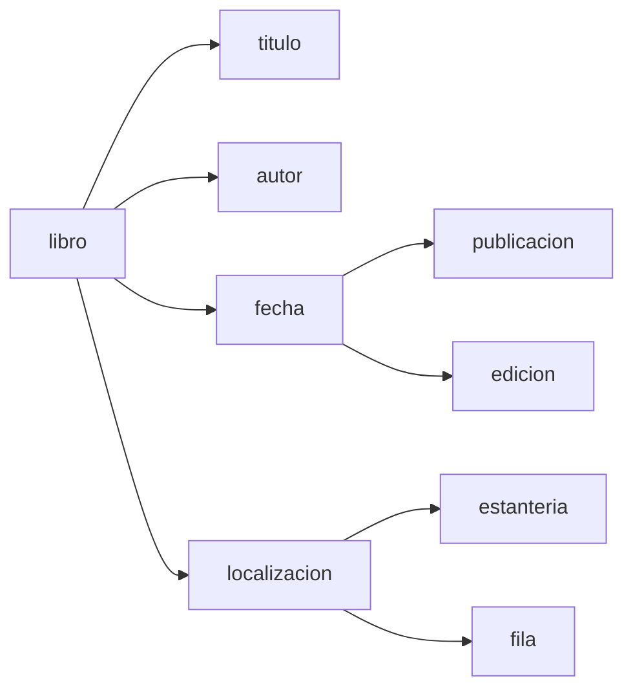

```mermaid
graph LR
    A[libro]
    A --> B[titulo]
    A --> C[autor]
    A --> D[fecha]
    D --> E[publicacion]
    D --> F[edicion]
    A --> G[localizacion]
    G --> H[estanteria]
    G --> I[fila]
```
